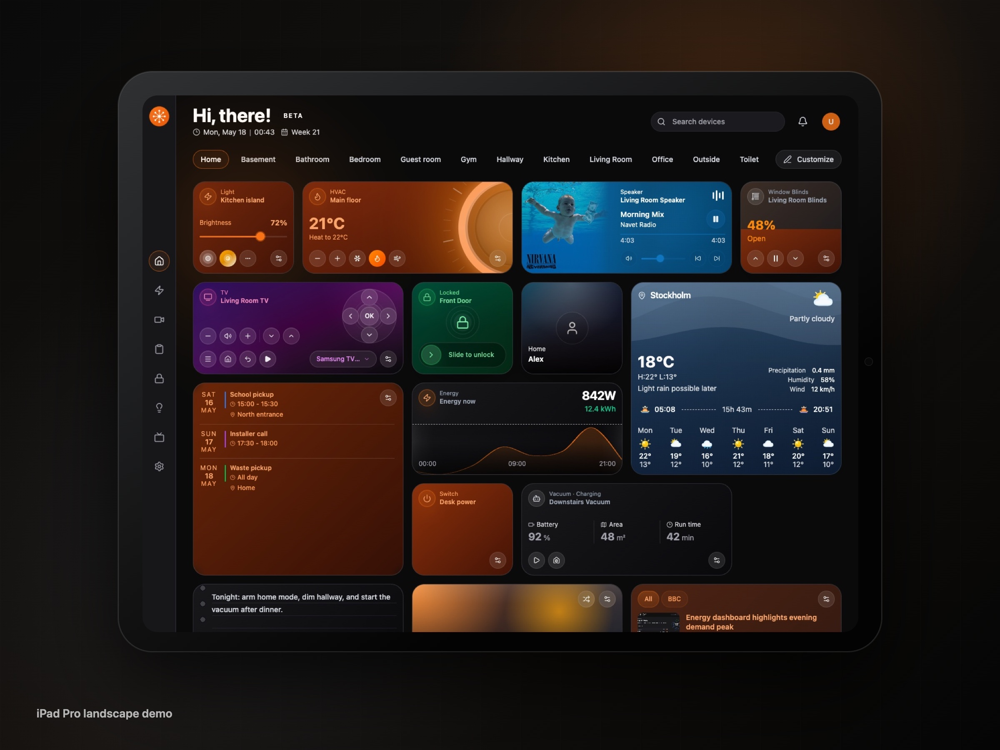
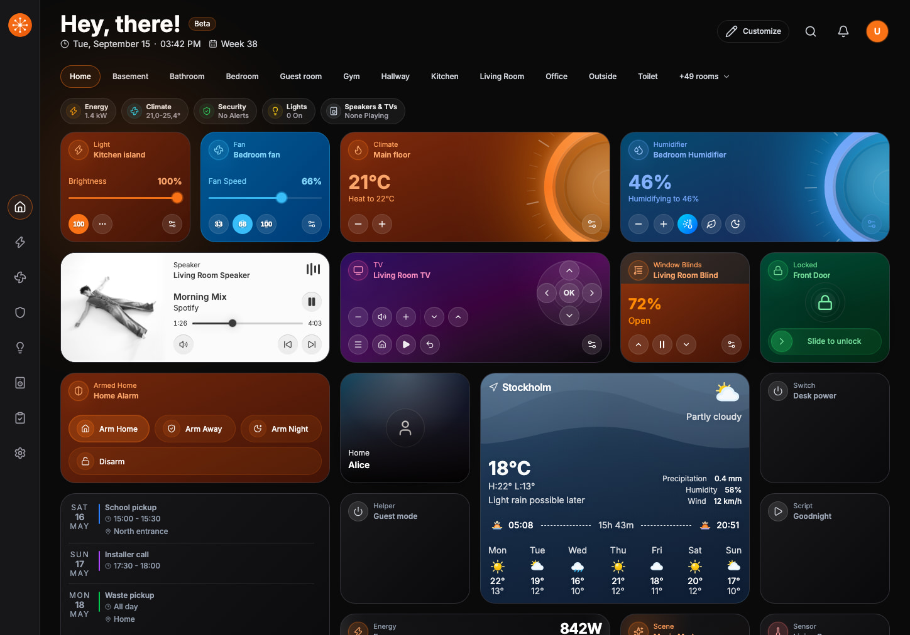
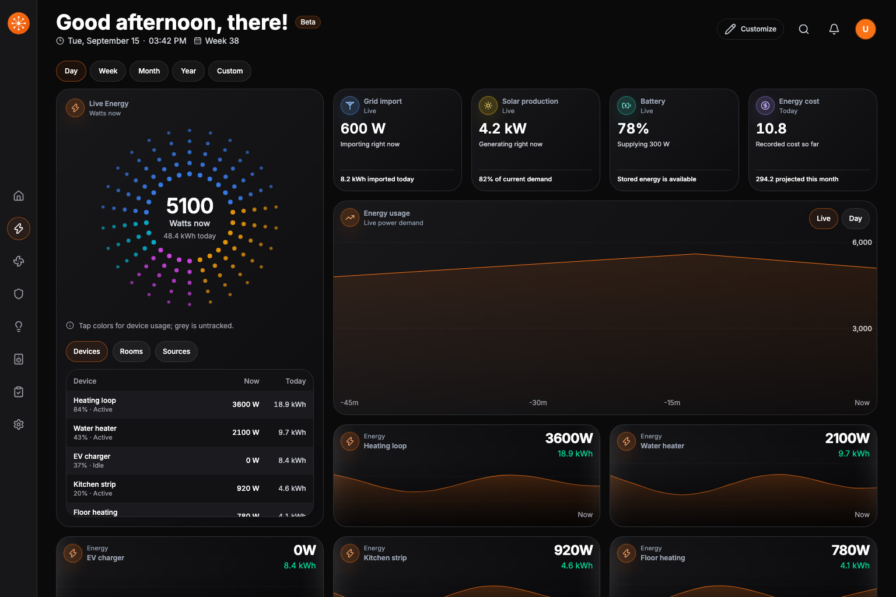
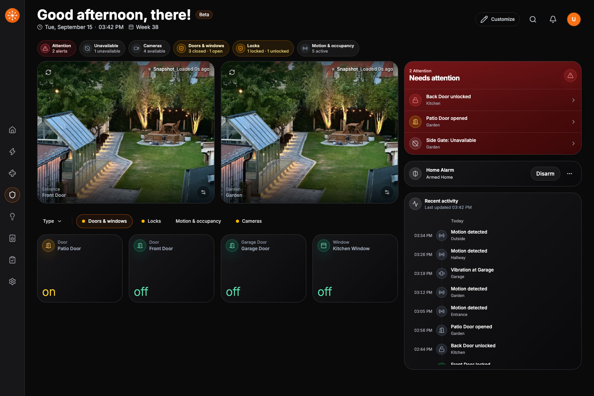

<div align="center">
  <h1>
    <picture>
      <source media="(prefers-color-scheme: dark)" srcset="assets/public/logo-horizontal-light.svg">
      
    </picture>
  </h1>

  <p><strong>A smart home dashboard for every screen.</strong></p>

  <p>
    Use Home Assistant, Homey, or openHAB through one polished, room-first interface<br>
    built for wall panels, tablets, desktops, and phones.
  </p>

  <p>
    <a href="https://demo.navet.app/"><strong>Explore the demo</strong></a>
    ·
    <a href="https://docs.navet.app/install/"><strong>Choose an installation</strong></a>
    ·
    <a href="https://docs.navet.app/">Read the docs</a>
  </p>

  <p>
    <a href="https://docs.navet.app/security/"></a>
    <a href="LICENSE.md"></a>
    <a href="https://github.com/awesomestvi/navet/stargazers"></a>
  </p>
</div>



## Your home, without the admin-screen clutter

Navet turns the smart-home platform you already use into a calmer daily control surface. Rooms,
lights, climate, media, energy, security, and routines stay easy to reach without making every
household member navigate a configuration interface.

- **Room-first control.** See what matters where it happens, then act without digging through
  entity lists.
- **One interface across screens.** Use the same dashboard on a wall panel, tablet, desktop, or
  phone.
- **Local by default.** Provider data, dashboard state, and credentials stay on your device or
  server—not on Navet servers.
- **Open source.** Run it yourself, inspect the code, and help shape what comes next.

## See Navet in action

| Home at a glance | Focused energy view | Security without the noise |
|---|---|---|
|  |  |  |

<div align="center">
  <a href="https://demo.navet.app/"><strong>Open the live demo →</strong></a>
</div>

## Built for everyday control

Navet includes focused sections for **Home**, **Lights**, **Media**, **Energy**, **Climate**,
**Security**, **Tasks**, and **Settings**. Depending on your provider, you can control and monitor:

- lights, switches, fans, covers, locks, alarm panels, scenes, vacuums, and lawn mowers
- climate systems, humidifiers, weather, people, calendars, and sensors
- cameras, media players, energy flows, task automations, and household notifications
- Navet widgets for notes, photos, RSS, batteries, UPS status, maps, actions, and generic entities

Home layouts are editable, dashboard profiles cover standard and wall-display use, and the PWA
includes four theme families, wallpapers, adaptive visual effects, and localization.

## Works with the platform you already use

| Provider | Available today | Ways to run Navet |
|---|---|---|
| **Home Assistant** | Navet's broadest integration, including advanced climate, media, camera, energy, weather, calendar, notification, task, history, security, and administration services | Custom panel via HACS, Home Assistant add-on, or standalone |
| **Homey** | Rooms, realtime entities, lights, switches, and sensors | Standalone; optional additional provider when OAuth is configured |
| **openHAB** | Rooms, realtime entities, lights, switches, and sensors | Standalone; optional additional provider from Settings |

A supported standalone installation can retain multiple provider sessions and combine selected
providers in shared dashboard collections. Capabilities are not identical: Home Assistant is the
most mature integration today. Check the
[provider capability matrix](https://docs.navet.app/integrations/) before choosing a setup for
media, cameras, energy, weather, calendars, notifications, or tasks.

Hubitat and SmartThings are planned, not supported runtimes. Follow the
[public roadmap](https://docs.navet.app/roadmap/) for progress.

## Choose your installation

| If you use… | Start here |
|---|---|
| Home Assistant | [Choose a custom panel, add-on, or standalone installation](https://docs.navet.app/install/home-assistant/) |
| Homey | [Connect Navet through the Homey OAuth flow](https://docs.navet.app/install/homey/) |
| openHAB | [Connect Navet to your openHAB instance](https://docs.navet.app/install/openhab/) |
| A development build | [Install Navet Dev](https://docs.navet.app/install/navet-dev/) |

Not sure which route fits? [Compare every installation option](https://docs.navet.app/install/).

## Private by design

Navet is made for self-hosted smart homes. It does not require a Navet cloud account, and it does
not send your provider data to Navet servers. Treat any public deployment as a sensitive control
surface: use HTTPS, least-privilege provider accounts, and the guidance in the
[security policy](https://docs.navet.app/security/).

Please report vulnerabilities privately to `security@navet.app` rather than opening a public issue.

## Contribute to Navet

Navet is an AGPL-3.0 open-source project. Whether you want to fix a bug, improve a provider, refine
the dashboard, or document a setup, start with the [contribution guide](CONTRIBUTING.md).

```bash
git clone https://github.com/awesomestvi/navet.git
cd navet
pnpm install
pnpm dev
```

Prerequisites: Node.js `^20.19.0` or `>=22.12.0`, pnpm 11, and Git.

<details>
<summary><strong>Repository architecture</strong></summary>

Navet is moving toward provider-neutral core and UI packages, provider-owned adapters, and an
official app-composition layer:

```text
packages/
  core/                       provider-neutral contracts and runtime types
  ui/                         target provider-neutral shared UI boundary
  provider-homeassistant/     Home Assistant adapter
  provider-homey/             Homey adapter
  provider-openhab/           openHAB adapter
  provider-hubitat/           planned provider surface
  provider-smartthings/       planned provider surface
  app/                        dashboard and app composition

apps/
  standalone/                 standalone application
  ha-panel/                   Home Assistant panel wrapper
  demo/                       public product demo
  website/                    navet.app
  docs/                       docs.navet.app
  storybook/                  shared UI review surface
```

Much of the current shared UI implementation still lives in `packages/app/src/components/*` and
`packages/app/src/ui-kit/*`; `@navet/ui` is the target shared boundary rather than a claim that the
extraction is already complete. Read the [repository documentation map](docs/README.md) before
making architecture changes.

</details>

## Project links

- [Website](https://navet.app/)
- [Live demo](https://demo.navet.app/)
- [Documentation](https://docs.navet.app/)
- [Storybook](https://storybook.navet.app/)
- [Roadmap](https://docs.navet.app/roadmap/)
- [Security policy](https://docs.navet.app/security/)
- [Code of conduct](CODE_OF_CONDUCT.md)
- [Trademark policy](docs/branding/TRADEMARK_POLICY.md)

## License

Navet is licensed under the [GNU Affero General Public License v3.0](LICENSE.md). If you run a modified
version for users over a network, the AGPL requires you to make the corresponding source available
to those users. See the [terms of use](docs/TERMS_OF_USE.md) and
[trademark policy](docs/branding/TRADEMARK_POLICY.md) for details.
